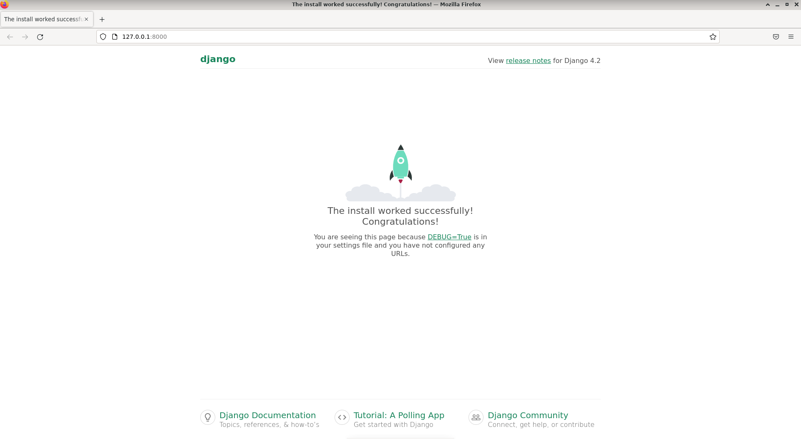
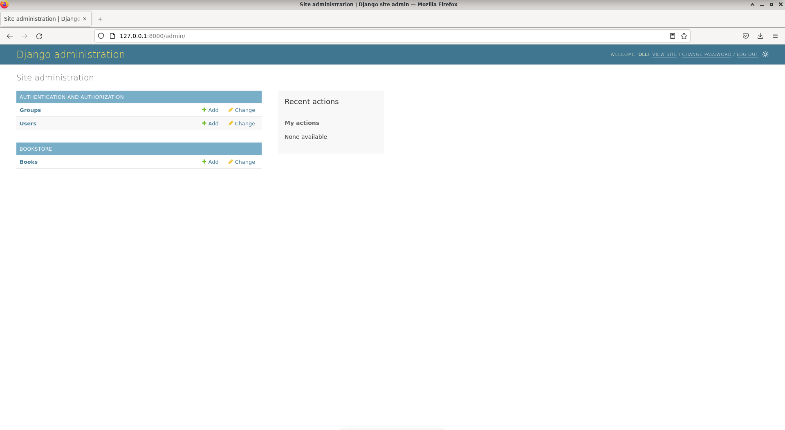
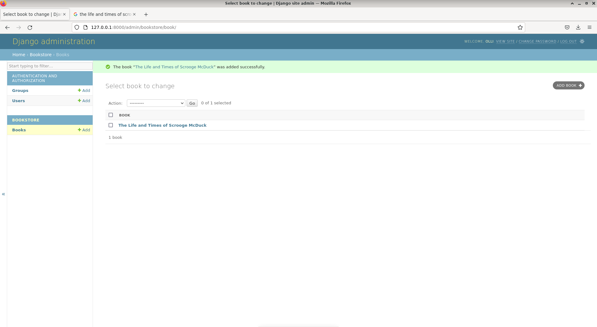
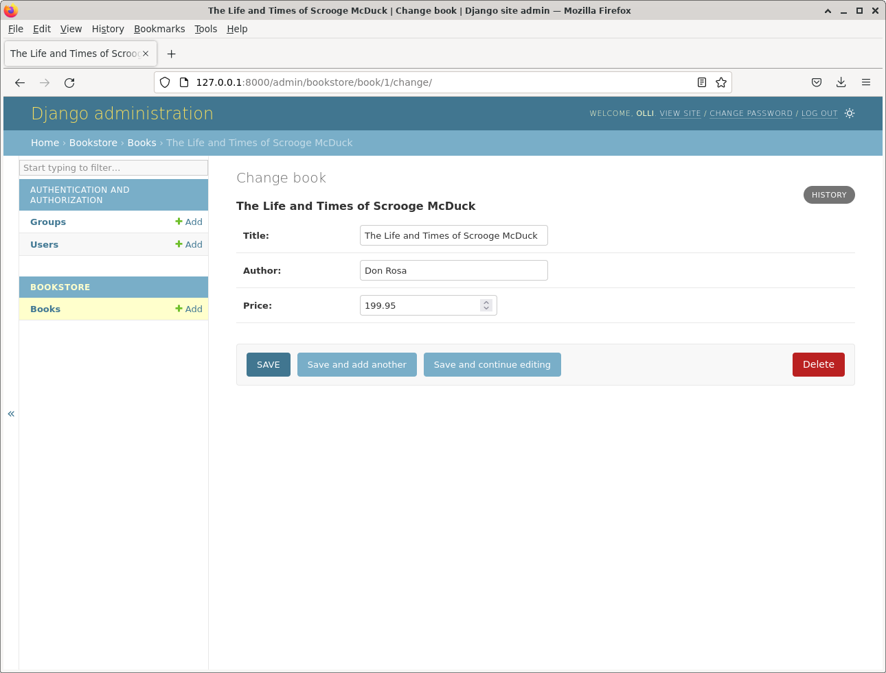

# h1 Hello Django

## Ympäristö
Tein harjoituksen 22.05.2023 virtuaalikoneessa Debian 11 käyttöjärjestelmällä.

## Django kehitysympäristön asennus
Asensin virtualenv-työkalun komennolla:
`$ sudo apt get install virtualenv`.

Loin uuden virtuaaliympäristön, jossa on viimeisimmät paketit ja käytetään python versiota kolme, komennolla
`virtualenv --system-site-packages -p python3 env/`.

Aktivoin virtuaaliympäristön komennolla:
`$ source env/bin/activate`.

Ennen djangon asennusta varmistin, että asennus tapahtuu virtuaaliympäristöön.
`which pip`

Loin tekstitiedoston, jossa määritellään projektin riippuvuudet, tässä tapauksessa pelkkä django ja asensin sen käyttäen pip-työkalua.
```
$ echo django > requirements.txt 
$ pip install -r requirements.txt
```

Varmistin, että django on asennettu komennolla:
```
$ django-admin --version 
4.2.1
```

## Django projektin luonti ja testaus
Loin uuden django-projektin nimeltä ollico: `$ django-admin startproject ollico`
Testasin, että djangon oletussivu tulee näkyviin selaimessa:
```
$ cd ollico 
$ ./manage.py runserver
```


## Admin käyttöliittymän lisäys
Päivitin ensin tietokannan komennoilla:
```
$ ./manage.py makemigrations
$ ./manage.py migrate
```

Lisäsin uuden käyttäjän: `$ ./manage.py createsuperuser`

Nyt admin käyttöliittymä toimii osoitteessa /admin.

## Luodaan uusi sovellus projektiin ja sinne tietokantaan uusi taulu

Loin uuden sovelluksen komennolla: `$ ./manage.py startapp bookstore`
Sovellus pitää lisätä settings\.py -tiedostoon
```
INSTALLED_APPS = [
    'django.contrib.admin',
    'django.contrib.auth',
    'django.contrib.contenttypes',
    'django.contrib.sessions',
    'django.contrib.messages',
    'django.contrib.staticfiles',
    'bookstore',
]
```

Loin uuden luokan bookstoren models.py tiedostoon
```
from django.db import models

Class Book(models.Model):
    title = models.CharField(max_length=300)

     def __str__(self):
        return self.title
```

Päivitin tietokannan:
```
$ ./manage.py makemigrations
$ ./manage.py migrate
```

Rekisteröin uuden mallin bookstoren admin.py tiedostoon
```
from django.contrib import admin
from . import models 

admin.site.register(models.Book)
```

Käynnistin palvelimen uudelleen
`$ /manage.py runserver`

Nyt admin käyttöliittymässä näkyy bookstore sekä malli book.


## Lisätään uusi kirja Djangon admin-käyttöliittymällä

Valitsin Djangon admin-sivulla "Books" kentästä "Add". Lisäsin seuravalla sivulla kirjalle otsikon ja painoin save. Uusi kirja tallentui tietokantaan



## Uusien attribuuttien lisäys tauluun

Lisäsin models.py tiedostoon Book luokkaan uusia muuttujia:
```
from django.db import models

class Book(models.Model):
    title = models.CharField(max_length=300)
    author = models.CharField(max_length=300) #uusi
    price = models.DecimalField(max_digits=8, decimal_places=2) #uusi

    def __str__(self):
        return self.title
```

Yritin päivittää tietokantaa:
```
$ ./manage.py makemigrations
It is impossible to add a non-nullable field 'author' to book without specifying a default. This is because the database needs something to populate existing rows.
Please select a fix:
 1) Provide a one-off default now (will be set on all existing rows with a null value for this column)
 2) Quit and manually define a default value in models.py.
Select an option: 
```

koska minulla oli vain yksi taulu tietokannassa valitsin kohdan 1:

```
Select an option: 1
Please enter the default value as valid Python.
The datetime and django.utils.timezone modules are available, so it is possible to provide e.g. timezone.now as a value.
Type 'exit' to exit this prompt
>>> Don Rosa
Invalid input: unexpected EOF while parsing (<string>, line 1)
>>> "Don Rosa"
It is impossible to add a non-nullable field 'price' to book without specifying a default. This is because the database needs something to populate existing rows.
Please select a fix:
 1) Provide a one-off default now (will be set on all existing rows with a null value for this column)
 2) Quit and manually define a default value in models.py.
Select an option: 199.95
Please select a valid option: 1
Please enter the default value as valid Python.
The datetime and django.utils.timezone modules are available, so it is possible to provide e.g. timezone.now as a value.
Type 'exit' to exit this prompt
>>> 199.95
Migrations for 'bookstore':
  bookstore/migrations/0002_book_author_book_price.py
    - Add field author to book
    - Add field price to book
```

Tämän jälkeen suoritin migraation `$ ./manage.py migrate` ja käynnistin palvelmien uudelleen `$ ./manage.py runserver`.

Nyt kirjalla on uusia kenttiä ja asettamani tiedot näkyvät aiemmin lisäämässäni kirjassa:



