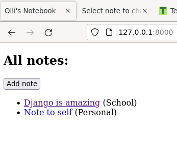
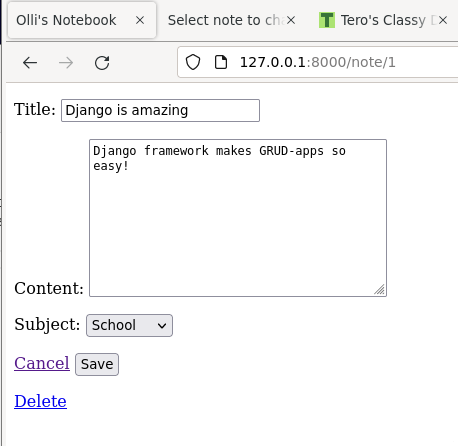
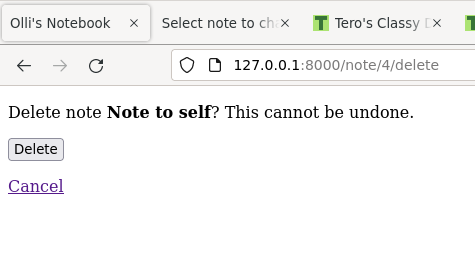

# h3 CRUD-sovellus
Tein tehtävää varten muistiinpano sovelluksen. Sovelluksessa voi luoda muisitiinpanoja, joilla on otsikko, sisältö ja aihe. Aiheet ovat oma taulunsa tietokannassa, mutta niitä voi lisätä vain admin käyttöliittymässä. Muistiinpanoja voi luoda, muokata ja poistaa sovelluksen omalla käyttöliittymällä.

