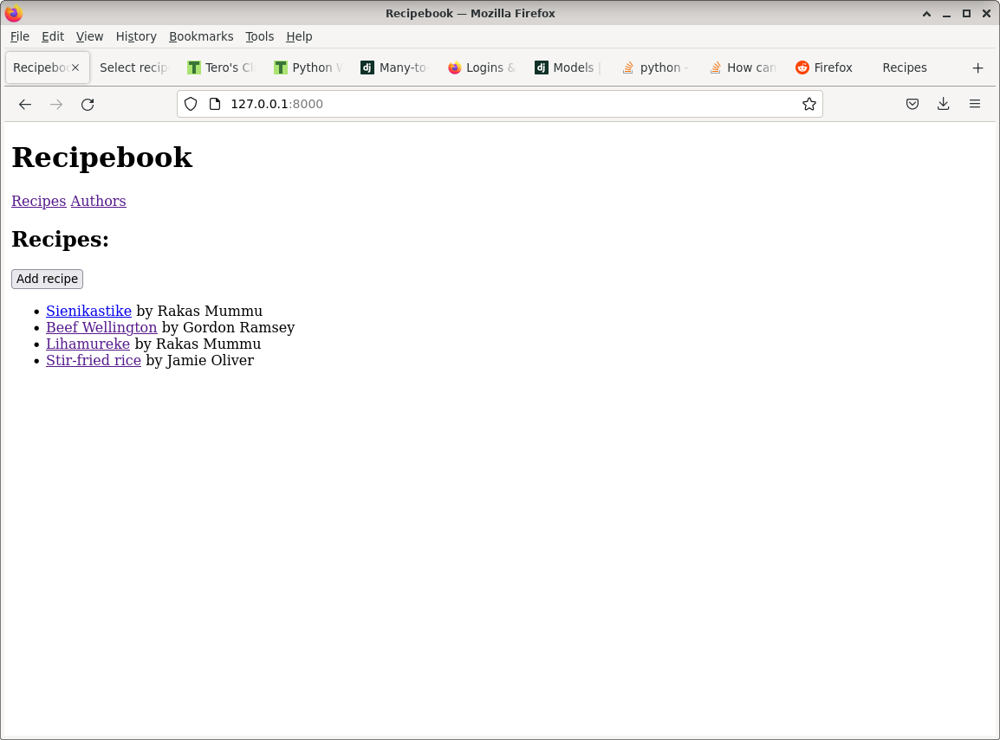
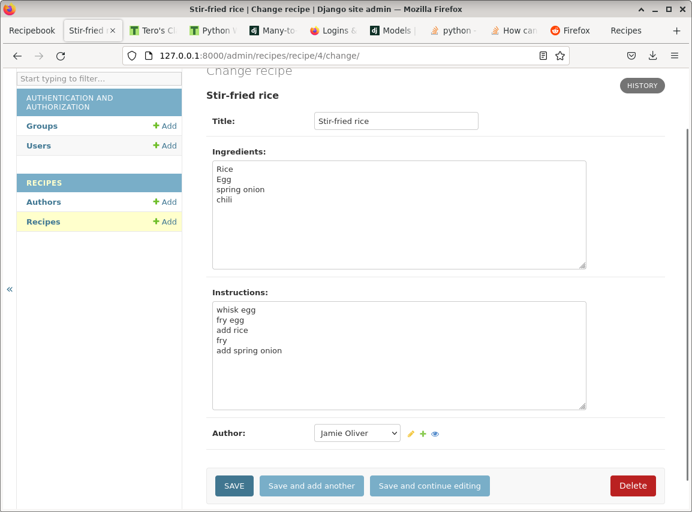
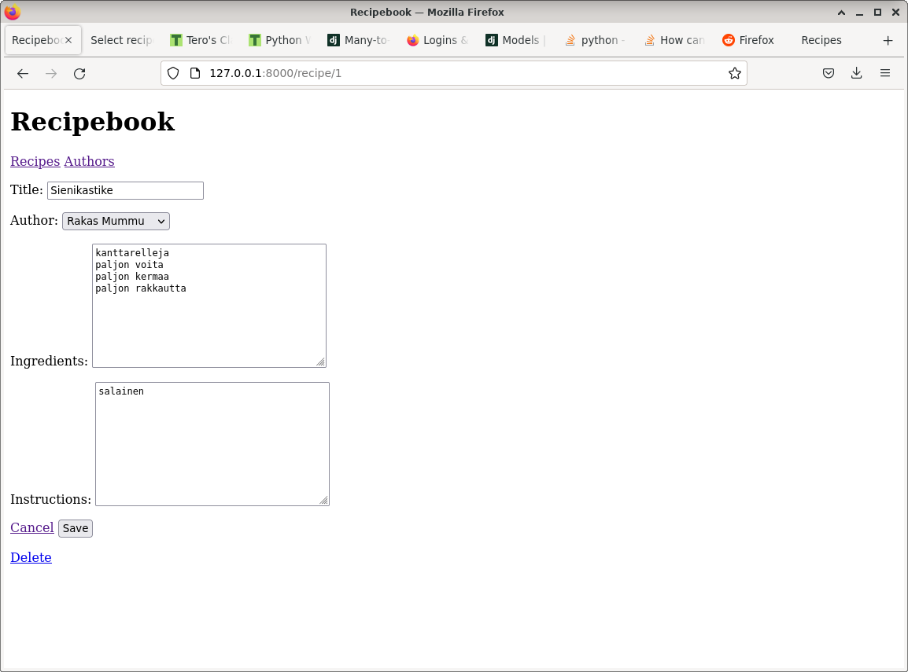
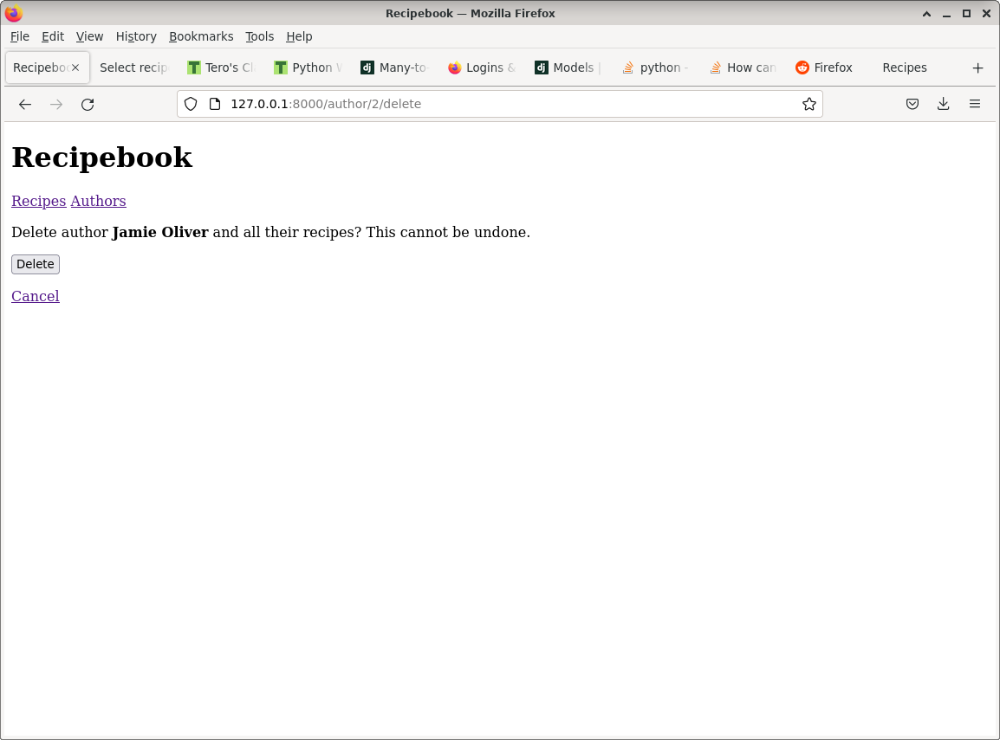
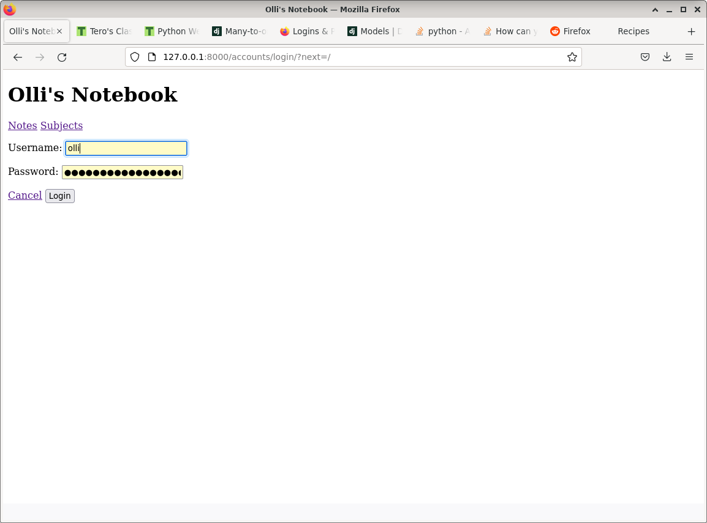

# h4 Suhteita

a) Tee alusta lähtien uusi CRUD-ohjelma, jossa on vähintään kaksi model-luokkaa (ja siten taulua) sekä niiden välillä riippuvuus (ForeignKey). Kokeile, että riippuvuus toimi sekä automaattisessa hallintaliittymässä (Django admin) että itse muoteilla tekemilläsi sivuilla.

Tein tätä harjoitusta varten reseptikirjasovelluksen. Sovelluksessa voi tallentaa, muokata ja poistaa reseptejä. Resepteillä on myös kirjottajat, joita voi tallentaa muokata ja poistaa.

Reseptit listattuna:

Resepti admin käyttöliittymässä:

Reseptillä on otsikon lisäksi kirjoittaja, ainekset ja ohjeet:

Jos poistaa kirjoittajan, myös kaikki hänen reseptinsä poistetaan:

b) Vapaaehtoinen: Tee Djangolla sivu, joka vaatii kirjautumista (LoginRequiredMixin). Voit tehdä tämän sivun mihin vain olemassaolevaan projektiin.

Muokkasin edellistä muistiinpanosovellusta niin, että siihen pitää kirjautua sisään nähdäkseen muistiinpanot:

